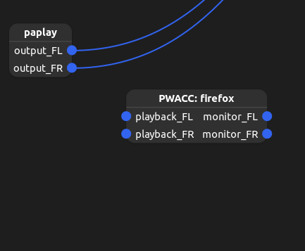
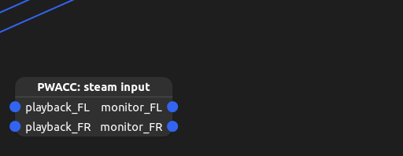

# PipeWire AutoConnectController (PWACC)

Need to share a specific application's audio? Need to automatically connect audio to or from an application like Firefox or MPV when it starts? Need to micspam in TF2?

Then this program should be useful to you!

## What it does

PWACC creates a new PipeWire node and then automatically connects either the input or output to applications matching a given pattern.

Example for Firefox: `./pwacc --name "PWACC: firefox" inputs "Firefox"`

Screencap from Helvum:

Then you can route the node in Helvum to whatever else you want the audio in, e.g. OBS, [Discord GoLive Bot](https://github.com/Kyuunex/DiscordLinuxGoLiveAudioWorkaroundBot), or your game's microphone input (for micspamming).

An input example for steam (TF2, source games, etc, that use steam input): `./pwacc --name "PWACC: steam input" outputs "steam"` (add `--mono` if your steam input/microphone is mono)

